# OpenProducer Architecture

## Overview

OpenProducer is a Laravel-based GitHub bot that acts as an intelligent orchestrator for breaking down large specifications into manageable GitHub issues using AI. The bot operates exclusively through the GitHub Issues API and never modifies repository files.

## High-Level Architecture

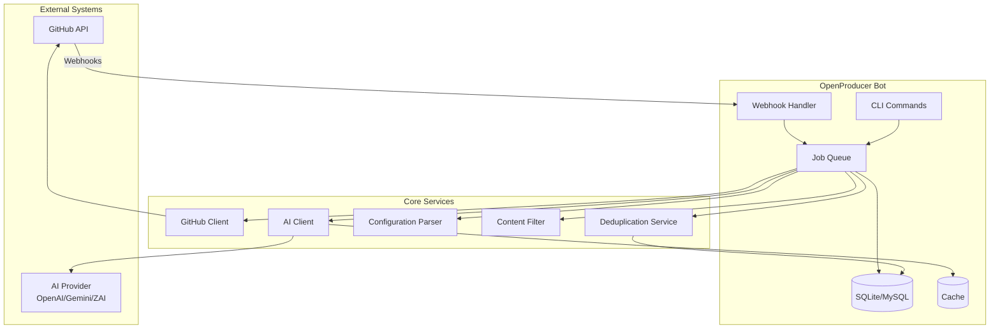

## System Components

### 1. Entry Points

#### 1.1 Webhook Handler
**File**: `app/Http/Controllers/IssueWebhookController.php`

The webhook handler receives GitHub webhook events and processes them.

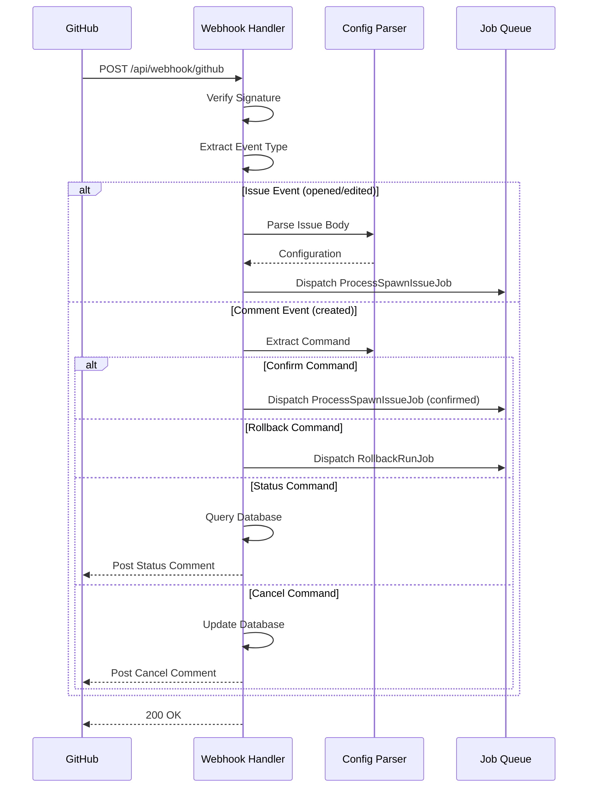

#### 1.2 CLI Commands
**Files**:
- `app/Console/Commands/BotProcessCommand.php`
- `app/Console/Commands/BotStatusCommand.php`
- `app/Console/Commands/BotRollbackCommand.php`

CLI commands allow manual triggering and management of bot operations.

### 2. Core Services Layer

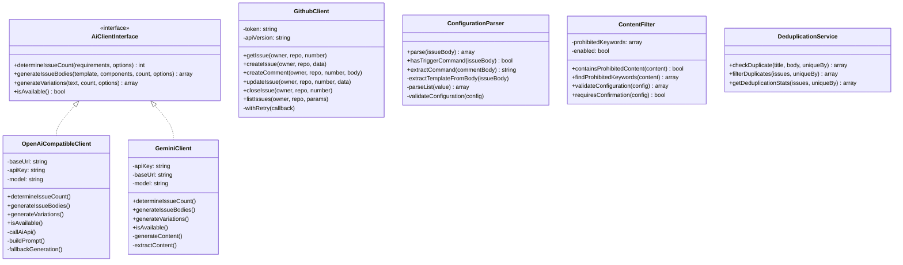

#### 2.1 AI Client Service

The AI client provides intelligent issue breakdown and generation capabilities.

**Key Features**:
- Automatic issue count determination based on complexity
- Context-aware issue generation
- Multiple provider support (OpenAI, Gemini, ZAI GLM 4.6, custom)
- Fallback mode for AI unavailability
- Response caching to reduce API calls

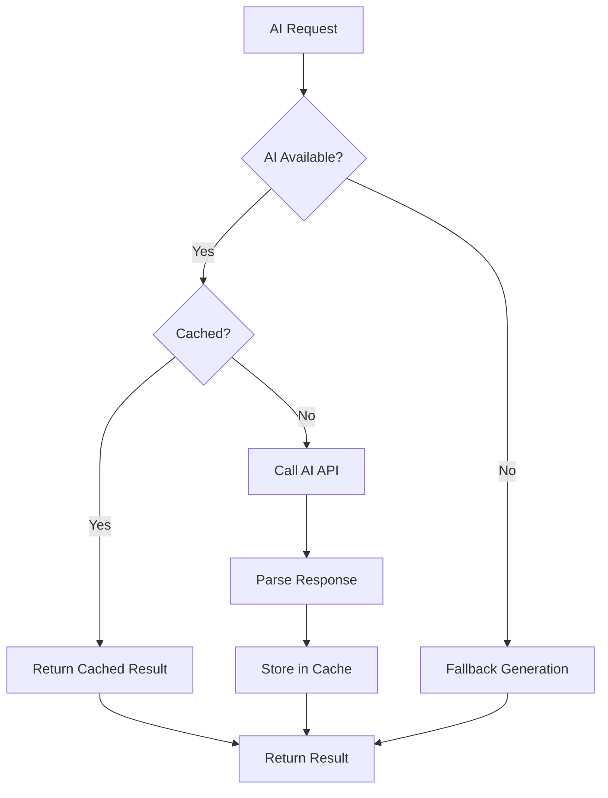

#### 2.2 GitHub Client Service

Handles all GitHub API interactions with retry logic and rate limiting.

**Key Features**:
- Exponential backoff retry strategy
- Rate limit handling
- Both Personal Access Token and GitHub App authentication
- Webhook signature verification

#### 2.3 Configuration Parser

Parses bot commands and configuration from issue bodies and comments.

**Supported Formats**:
- Mention-based trigger: `@TheOpenProducerBot`
- Legacy command: `/spawn-issues`
- YAML-style configuration
- Free-form requirements (entire issue body as template)

#### 2.4 Content Filter

Security layer that filters prohibited content and enforces confirmation workflows.

**Key Features**:
- Configurable keyword filtering
- Automatic high-risk detection
- Confirmation threshold enforcement

#### 2.5 Deduplication Service

Prevents duplicate issue creation using configurable strategies.

**Strategies**:
- `title`: Hash based on issue title
- `body`: Hash based on issue body
- `hash`: Hash based on both title and body (default)

### 3. Job Processing Layer

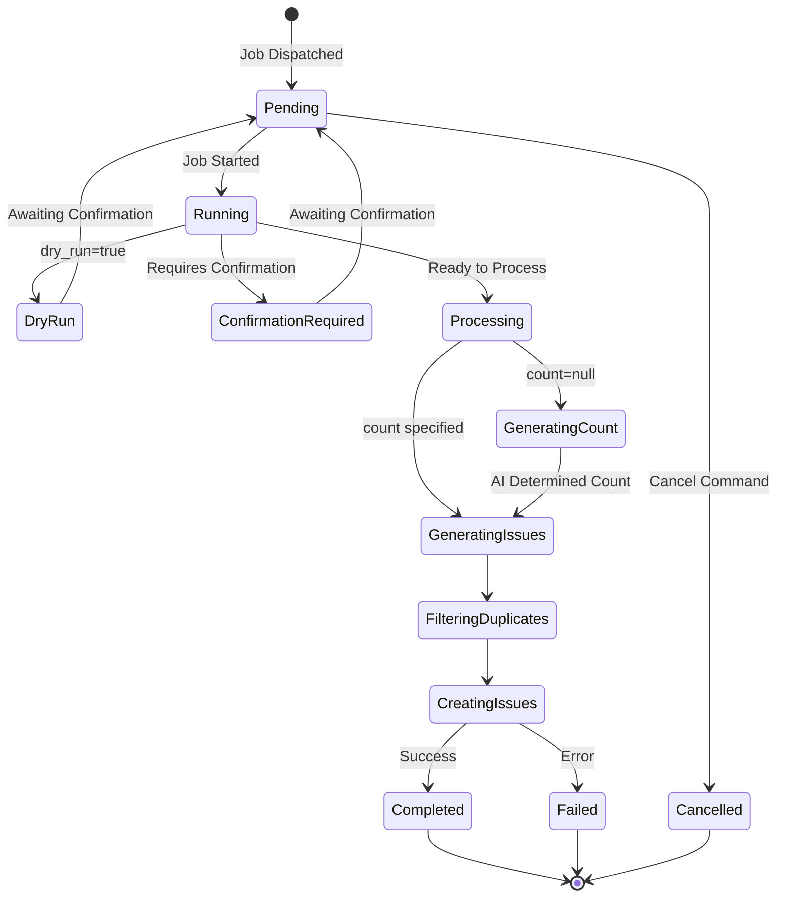

#### 3.1 ProcessSpawnIssueJob

Main job that orchestrates the entire issue creation workflow.

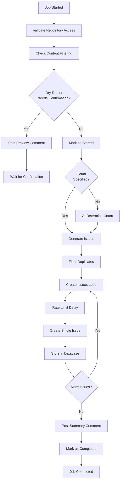

**Process Flow**:
1. **Validation**: Check repository access
2. **Content Filtering**: Validate against prohibited keywords
3. **Dry Run/Confirmation**: Post preview if needed
4. **Count Determination**: Use AI if count not specified
5. **Issue Generation**: Generate unique issues using AI
6. **Deduplication**: Filter out duplicates
7. **Issue Creation**: Create issues on GitHub with rate limiting
8. **Summary**: Post completion summary with links

#### 3.2 RollbackRunJob

Handles rollback of created issues by closing them.

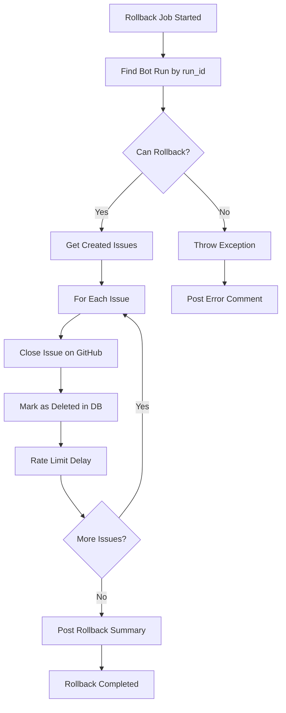

### 4. Data Layer

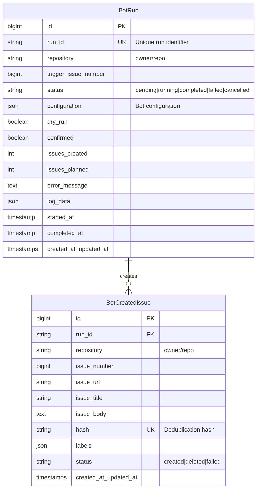

#### 4.1 BotRun Model

Tracks bot execution runs with complete metadata and status.

**Statuses**:
- `pending`: Waiting for confirmation or processing
- `running`: Currently executing
- `completed`: Successfully completed
- `failed`: Failed with error
- `cancelled`: Cancelled by user

**Key Methods**:
- `generateRunId()`: Creates unique run identifier (format: `run_YYYYMMDD_HHMMSS_random`)
- `markAsStarted()`: Update status to running
- `markAsCompleted()`: Update status to completed
- `markAsFailed()`: Update status to failed
- `canRollback()`: Check if rollback is possible
- `getSummary()`: Get run summary with metrics

#### 4.2 BotCreatedIssue Model

Records all issues created by the bot for tracking and rollback.

**Key Methods**:
- `generateHash()`: Create deduplication hash
- `existsByHash()`: Check if issue already exists
- `markAsDeleted()`: Mark as deleted during rollback
- `markAsFailed()`: Mark as failed if creation failed

### 5. Complete Workflow

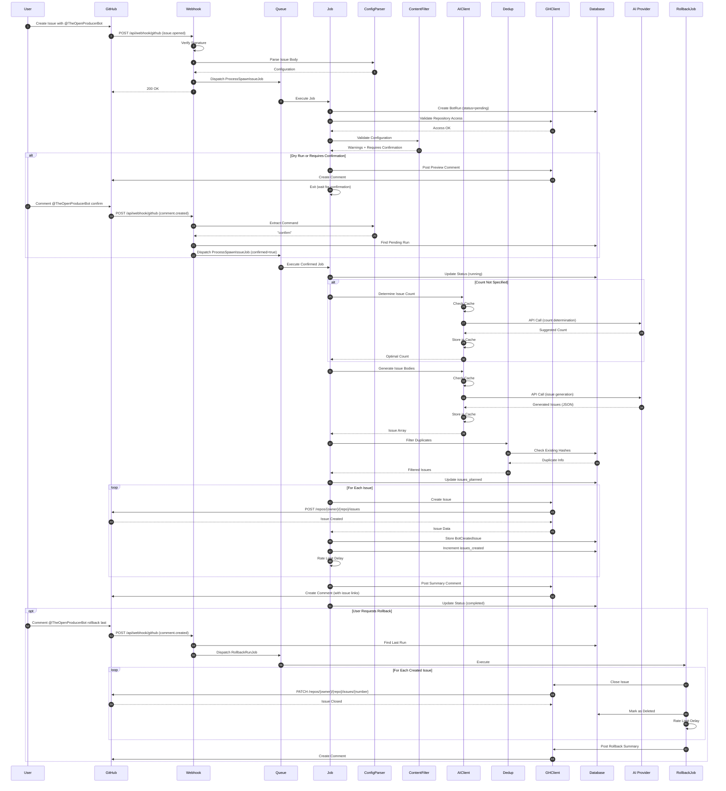

## Configuration Architecture

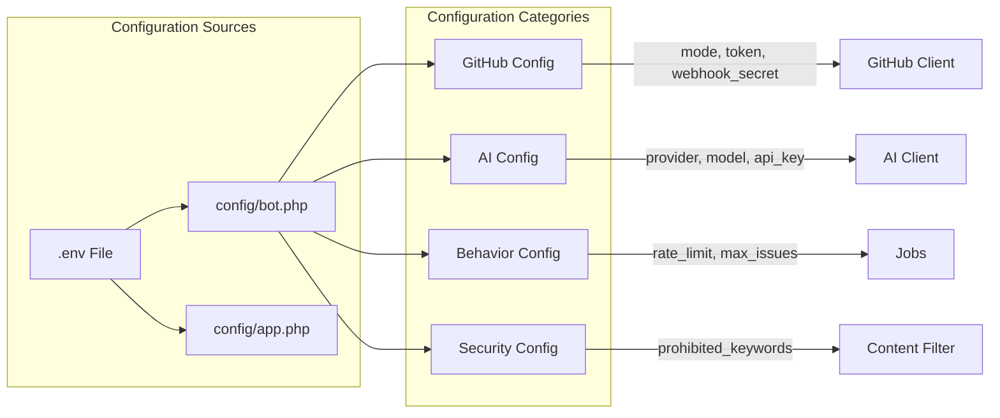

### Configuration Hierarchy

1. **GitHub Configuration** (`config/bot.php` → `github`)
   - Authentication mode (token/app)
   - API version
   - Webhook secret

2. **AI Provider Configuration** (`config/bot.php` → `openai`/`gemini`)
   - Provider selection
   - Model configuration
   - API endpoints
   - Caching settings

3. **Behavior Configuration** (`config/bot.php` → `behavior`)
   - Rate limiting
   - Maximum issues per run
   - Retry settings
   - Confirmation thresholds

4. **Security Configuration** (`config/bot.php` → `prohibited_keywords`)
   - Content filtering rules
   - Prohibited keywords list

## Security Architecture

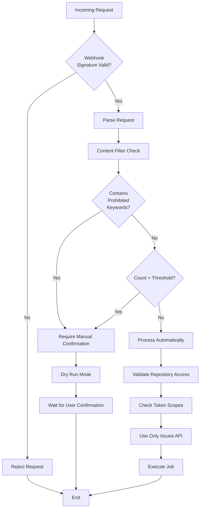

### Security Principles

1. **No Repository File Modifications**
   - Bot only uses GitHub Issues API
   - Never performs git operations
   - No file commits or pushes

2. **Content Filtering**
   - Configurable prohibited keywords
   - Automatic malicious content detection
   - Manual confirmation for flagged content

3. **Webhook Verification**
   - HMAC signature verification
   - Secret-based authentication

4. **Rate Limiting**
   - Configurable rate limits
   - Exponential backoff on failures
   - Respects GitHub API limits

5. **Confirmation Workflow**
   - Dry run mode for preview
   - Manual confirmation for high-risk operations
   - Threshold-based automatic confirmation

## Deployment Architecture

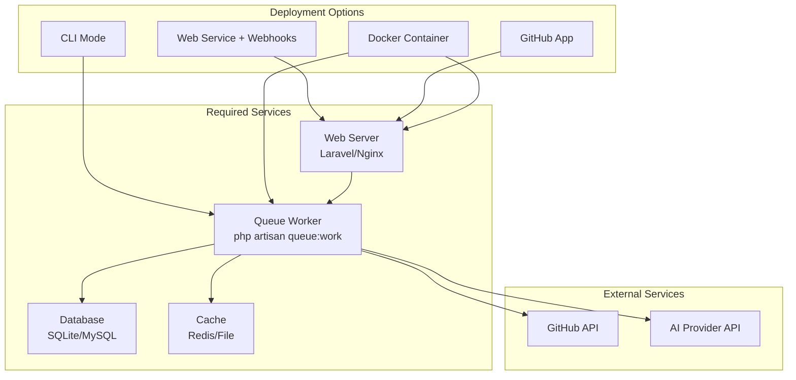

### Deployment Modes

1. **Web Service with Webhooks**
   - Laravel web server receives GitHub webhooks
   - Queue workers process jobs asynchronously
   - Recommended for production

2. **GitHub App**
   - OAuth App integration
   - Installation-based authentication
   - Fine-grained permissions

3. **CLI Mode**
   - Manual job triggering via artisan commands
   - Useful for testing and development
   - No webhook required

4. **Docker Container**
   - Containerized deployment
   - Includes web server and queue worker
   - Easy scaling and deployment

## Error Handling and Resilience

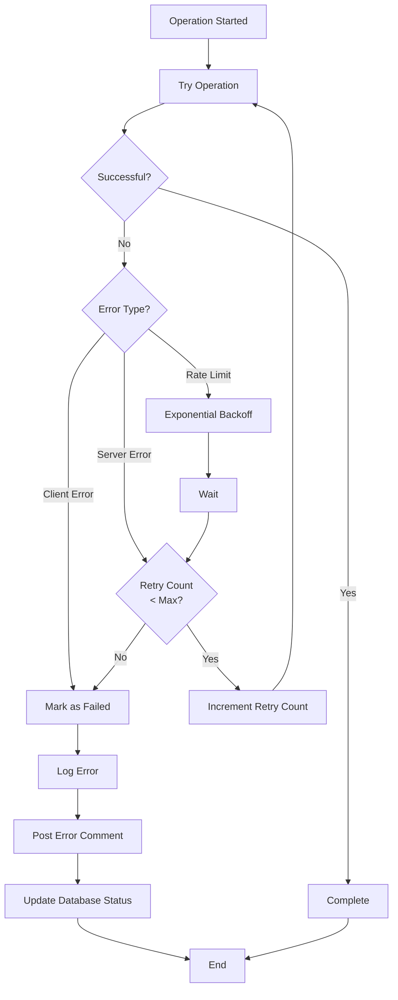

### Error Handling Strategy

1. **Retry with Exponential Backoff**
   - Automatic retry for transient failures
   - Configurable retry attempts (default: 3)
   - Exponential backoff (2^attempt seconds)

2. **Graceful Degradation**
   - AI service unavailable → Fallback to template duplication
   - GitHub API rate limit → Automatic backoff
   - Partial failure → Continue with successful operations

3. **Comprehensive Logging**
   - All operations logged to database
   - Detailed error messages
   - Trace information for debugging

4. **User Notification**
   - Error comments posted to trigger issue
   - Status updates in comments
   - Clear error messages

## AI Integration Architecture

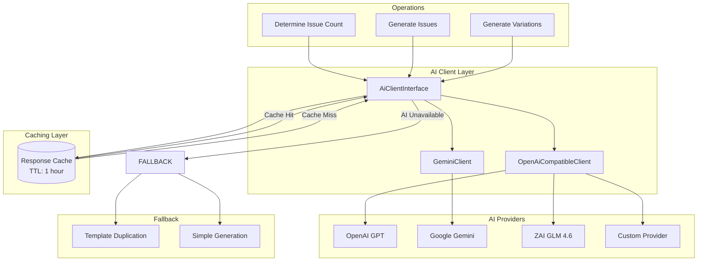

### AI Provider Selection

The bot selects the AI client based on the `OPENAI_PROVIDER` environment variable:

- `OPENAI`: Uses OpenAI GPT models via OpenAI-compatible API
- `GEMINI`: Uses Google Gemini via native Gemini API
- `ZAI`: Uses ZAI GLM 4.6 via OpenAI-compatible API
- `CUSTOM`: Custom OpenAI-compatible provider

### AI Operations

1. **Issue Count Determination**
   - Analyzes requirement complexity
   - Considers logical task breakdown
   - Returns optimal number of issues

2. **Issue Generation**
   - Creates unique, actionable issues
   - Incorporates components naturally
   - Follows GitHub best practices

3. **Text Variations**
   - Generates variations while maintaining meaning
   - Used for title/body variations
   - Helps with deduplication

## Performance Considerations

### Caching Strategy

1. **AI Response Caching**
   - TTL: 1 hour (configurable)
   - Cache key: MD5 hash of prompt
   - Reduces API costs and latency

2. **Service Availability Caching**
   - TTL: 5 minutes
   - Prevents repeated availability checks
   - Improves response time

### Rate Limiting

1. **GitHub API**
   - Configurable requests per minute
   - Automatic backoff on 429/403 responses
   - Respects Retry-After header

2. **Issue Creation**
   - Default: 30 issues per minute
   - Configurable via `BOT_RUN_RATE_LIMIT_PER_MINUTE`
   - Per-issue delay calculation

### Queue Processing

1. **Asynchronous Job Processing**
   - Laravel queue system
   - Configurable retry attempts
   - Job timeout: 10 minutes

2. **Database Optimization**
   - Indexed columns for fast queries
   - Foreign key relationships
   - Efficient status tracking

## Monitoring and Observability

### Logging Layers

1. **Application Logs** (`storage/logs/laravel.log`)
   - All operations and errors
   - Structured logging with context
   - Debug information

2. **Database Logs** (`bot_runs` table)
   - Run metadata and status
   - Configuration snapshots
   - Timing information

3. **Issue Tracking** (`bot_created_issues` table)
   - All created issues
   - Deduplication hashes
   - Status tracking

### Health Monitoring

```mermaid
graph LR
    HEALTH[/api/health] --> CHECK_APP[Check Application]
    CHECK_APP --> CHECK_DB[Check Database]
    CHECK_DB --> CHECK_QUEUE[Check Queue]
    CHECK_QUEUE --> RESPONSE[Health Response]
```

## Extension Points

The architecture supports extensions through:

1. **New AI Providers**
   - Implement `AiClientInterface`
   - Register in `AiServiceProvider`

2. **Custom Commands**
   - Add to `IssueWebhookController`
   - Update `config/bot.php` commands

3. **Additional Filters**
   - Extend `ContentFilter`
   - Add configuration options

4. **Custom Deduplication**
   - Modify `BotCreatedIssue::generateHash()`
   - Support new strategies

## Technology Stack

- **Framework**: Laravel 11+
- **Language**: PHP 8.2+
- **Database**: SQLite / MySQL
- **Queue**: Laravel Queue (database driver)
- **Cache**: File / Redis
- **HTTP Client**: Guzzle (via Laravel HTTP)
- **AI Providers**: OpenAI, Google Gemini, ZAI GLM 4.6

## File Structure

```
OpenProducer/
├── app/
│   ├── Console/Commands/       # CLI commands
│   │   ├── BotProcessCommand.php
│   │   ├── BotStatusCommand.php
│   │   └── BotRollbackCommand.php
│   ├── Http/Controllers/       # HTTP controllers
│   │   └── IssueWebhookController.php
│   ├── Jobs/                   # Async jobs
│   │   ├── ProcessSpawnIssueJob.php
│   │   └── RollbackRunJob.php
│   ├── Models/                 # Eloquent models
│   │   ├── BotRun.php
│   │   └── BotCreatedIssue.php
│   ├── Providers/              # Service providers
│   │   ├── AppServiceProvider.php
│   │   └── AiServiceProvider.php
│   └── Services/               # Core services
│       ├── AiClientInterface.php
│       ├── OpenAiCompatibleClient.php
│       ├── GeminiClient.php
│       ├── GithubClient.php
│       ├── ConfigurationParser.php
│       ├── ContentFilter.php
│       └── DeduplicationService.php
├── config/
│   └── bot.php                 # Bot configuration
├── database/migrations/        # Database migrations
├── routes/
│   ├── api.php                # API routes (webhooks)
│   └── web.php                # Web routes
├── tests/                     # Test suite
└── storage/logs/              # Application logs
```

## Summary

OpenProducer uses a **layered architecture** with clear separation of concerns:

1. **Entry Layer**: Webhooks and CLI commands receive requests
2. **Service Layer**: Core services handle domain logic
3. **Job Layer**: Asynchronous processing with queues
4. **Data Layer**: Models and database for persistence
5. **External Layer**: GitHub API and AI provider integrations

The architecture is designed for:
- **Security**: No file modifications, content filtering, confirmation workflows
- **Resilience**: Retry logic, fallback modes, comprehensive error handling
- **Scalability**: Asynchronous processing, caching, rate limiting
- **Extensibility**: Interface-based design, provider abstraction
- **Observability**: Comprehensive logging, health monitoring, status tracking
